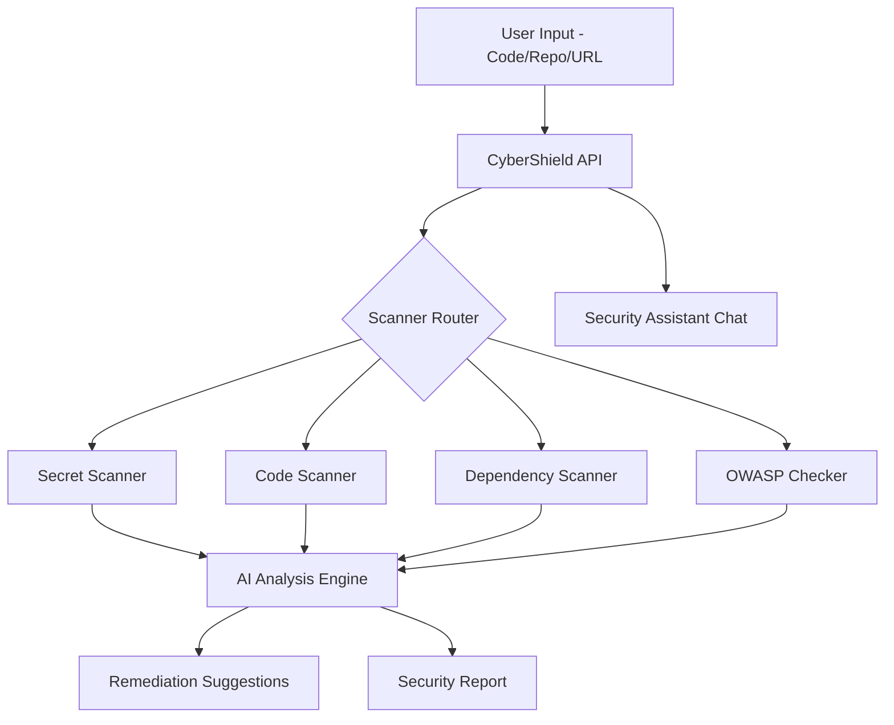

# CyberShield AI — AI Cybersecurity Copilot

> AI-powered security scanning, vulnerability detection, and automated remediation — for authorized security testing and defensive use.

[](LICENSE)
[](https://python.org)

> **DISCLAIMER**: This tool is intended for authorized security testing, defensive security research, and educational purposes only. Always obtain proper authorization before scanning any systems.

## Features

- [x] Secret & credential detection (API keys, tokens, passwords)
- [x] Static code security analysis (SQL injection, XSS, OWASP Top 10)
- [x] Dependency CVE scanning via OSV.dev API
- [x] AI-powered security code review
- [x] Automated remediation suggestions
- [x] CVE explanation in plain English
- [x] Security report generation (HTML)
- [x] AI security assistant chat
- [x] Integration with gitleaks / trufflehog / bearer (when installed)

## Architecture



## Vulnerability Types Detected

| Category | Examples |
|----------|---------|
| Secrets | AWS keys, GitHub tokens, private keys, DB passwords |
| Injection | SQL injection, command injection, path traversal |
| Web | XSS, CSRF, open redirect, insecure headers |
| Auth | Hardcoded creds, weak crypto, insecure session |
| Dependencies | Known CVEs via OSV.dev |

## Quick Start

```bash
git clone https://github.com/yourusername/cybershield-ai
cd cybershield-ai
cp .env.example .env
docker-compose up --build
```

Open `http://localhost:3000`.

## Optional: Install External Tools

```bash
# gitleaks (Go binary)
brew install gitleaks  # macOS
# or download from https://github.com/gitleaks/gitleaks/releases

# trufflehog
pip install trufflehog

# bearer
brew install bearer/tap/bearer
```

CyberShield falls back to built-in scanners if external tools are not found.

## License

MIT — see [LICENSE](LICENSE).
