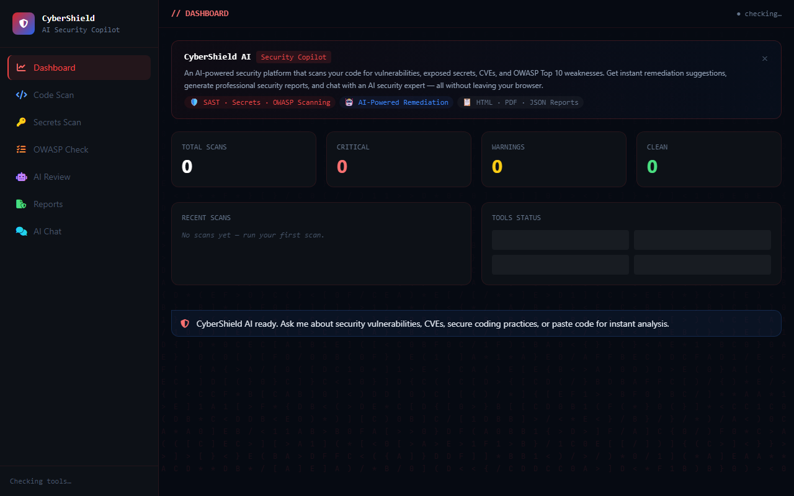
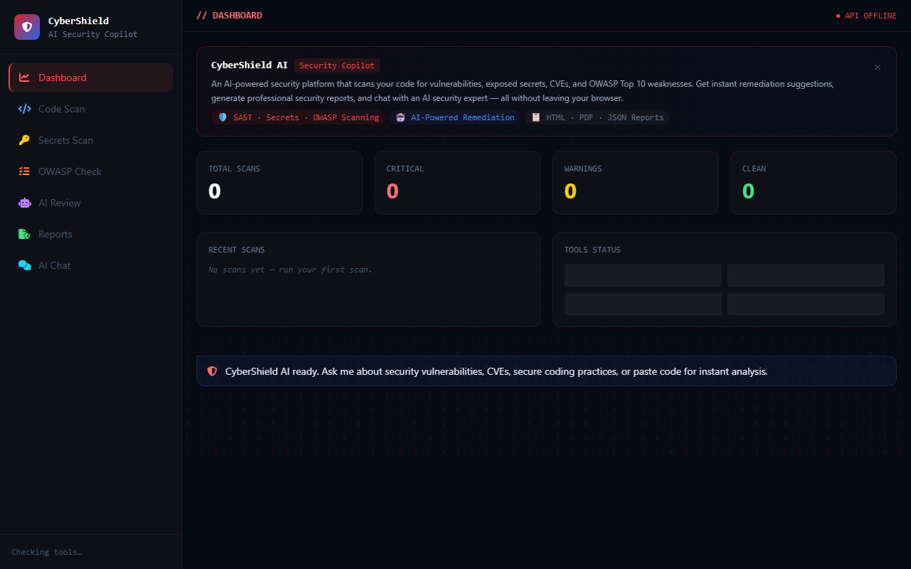
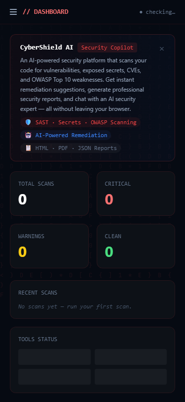

# CyberShield AI

[](https://github.com/isidhartha/cybershield-ai/discussions)

## Demo


### Screenshots

| Desktop Dashboard | Feature View | Mobile View |
|------------------|--------------|--------------|
|  |  |  |


**For authorized security testing and defensive use only. Always get permission before scanning systems you don't own.**

I built CyberShield AI because the security tools I kept using were either too narrow (one tool for secrets, another for CVEs, another for SAST) or too expensive. CyberShield pulls all of it into one place with an AI layer on top that actually explains what it finds in plain English, not just dumps a list of CVE numbers at you.

The target user is a developer who wants to check their own code before it ships — not a dedicated security team with enterprise tooling. It's self-hosted, runs in Docker, and gives you actionable output rather than walls of raw scanner output.

---

## What it scans

**Secrets and credentials** — Regex and entropy-based detection for API keys, tokens, private keys, connection strings, and passwords hardcoded anywhere in your codebase. It's caught AWS keys, GitHub PATs, Stripe secrets, database passwords — the things that show up in breach reports.

**Static code analysis** — Pattern matching against OWASP Top 10 vulnerabilities: SQL injection, command injection, XSS, path traversal, insecure deserialization, hardcoded credentials, weak crypto. Works across Python, JavaScript, TypeScript, Go, Java, and more.

**Dependency CVEs** — Reads your requirements files and package manifests, checks each dependency against the OSV.dev database, and tells you which packages have known vulnerabilities and how severe they are. No API key needed for this — OSV.dev is public.

**AI security review** — Goes beyond pattern matching. Sends your code to an AI model that understands context. It catches things like "this looks like a race condition that could allow privilege escalation" that a regex pattern would miss.

**Remediation suggestions** — For every finding, it tells you what to change. Not just "this is a SQL injection" but "replace this f-string with a parameterized query, here's the fixed version."

**Report generation** — Produces clean HTML security reports you can share or save. Useful when you need to show a security review to a client or a team lead.

---

## How to run it

### Prerequisites
- Python 3.10+
- Node.js 18+
- Git
- Redis (`redis-server`)
- Ollama (optional, for running AI features without any API key — https://ollama.com)

### Setup

```bash
# 1. Clone and enter the project
git clone https://github.com/isidhartha/cybershield-ai
cd cybershield-ai

# 2. Create virtual environment
# Windows:
python -m venv venv
venv\Scripts\activate
# Mac/Linux:
python3 -m venv venv
source venv/bin/activate

# 3. Install Python dependencies
pip install -r backend/requirements.txt

# 4. Configure environment
# Windows:
copy .env.example .env
# Mac/Linux:
cp .env.example .env
# Open .env and fill in at least one AI provider key
# OR set AI_PROVIDER=ollama to run AI features without any API key
# Note: the built-in scanners work with no AI key at all

# 5. Create reports directory
mkdir reports

# 6. Start services
# Redis (in a terminal):
redis-server

# 7. Run the backend
cd backend
uvicorn main:app --reload --port 8004

# 8. Run the frontend (in a new terminal, from project root)
cd frontend
npm install
npm run dev -- --port 3004
```

**Dashboard**: http://localhost:3004  
**API docs**: http://localhost:8004/docs

---

## Optional: Add external scanners

CyberShield has built-in scanners that work without anything extra installed. If you have these tools on your system, it'll pick them up automatically and use them on top of the defaults:

```bash
# gitleaks — excellent for git history scanning
# Download from: https://github.com/gitleaks/gitleaks/releases

# trufflehog — high signal-to-noise secret detection
pip install trufflehog

# bearer — modern SAST with OWASP coverage
# macOS: brew install bearer/tap/bearer
# Linux: https://docs.bearer.com/reference/installation
```

If none of these are installed, the built-in scanners kick in automatically. You won't notice the difference for most use cases.

---

## API

Swagger UI at `http://localhost:8000/docs`.

```
POST /api/v1/scan/secrets      — Scan for hardcoded secrets
POST /api/v1/scan/code         — Static analysis for vulnerabilities
POST /api/v1/scan/dependencies — Check dependencies against CVE databases
POST /api/v1/scan/full         — Run all scanners at once
POST /api/v1/ai/review         — AI-powered security code review
POST /api/v1/report/generate   — Generate a security report
POST /api/v1/chat              — Security assistant chat
```

---

## Vulnerability categories

| Category | What it catches |
|---|---|
| Secrets | AWS keys, GitHub tokens, private keys, database passwords, any high-entropy string |
| Injection | SQL injection, command injection, path traversal, LDAP injection |
| Web | XSS, CSRF, open redirect, insecure headers, cookie flags |
| Auth | Hardcoded credentials, weak hashing, insecure session handling |
| Dependencies | Known CVEs from OSV.dev, outdated packages |

---

## Configuration

| Variable | Description | Default |
|------------------|--------------|--------------|
| `OPENAI_API_KEY` | For AI analysis features | — |
| `REPORTS_DIR` | Where HTML reports are saved | `/app/reports` |
| `MAX_FILE_SIZE_MB` | Max file size for scanning | `10` |
| `SCAN_TIMEOUT` | Seconds before a scan is killed | `120` |

---

## Free local LLM option (no API key needed)

CyberShield AI supports [Ollama](https://ollama.com) as a drop-in alternative to OpenAI for the AI analysis features (CVE explanations, security assistant chat, remediation suggestions). The built-in scanners work without any LLM at all.

**1. Install Ollama**

Download and install from [https://ollama.com](https://ollama.com), then pull a model:

```bash
ollama pull llama3.2
```

**2. Start Ollama**

```bash
ollama serve
```

**3. Switch CyberShield to Ollama**

In your `.env` file, set:

```
LLM_PROVIDER=ollama
OLLAMA_BASE_URL=http://localhost:11434
OLLAMA_MODEL=llama3.2
```

Restart the backend. CVE explanations, the security assistant, and remediation suggestions will all run locally with no API key required.

**Note:** The secret scanner, SAST scanner, and dependency CVE checker are fully local and do not use any LLM — they work regardless of this setting.

---

## License

MIT. Build on it, fork it, use it for your own security work.
